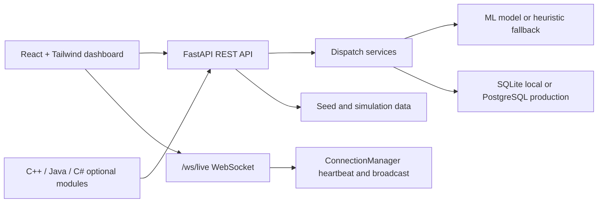

# RAID Nexus Architecture

## System Diagram

## Layers

Frontend: The Vite React app remains the operator surface. It uses typed contracts in `frontend/src/types`, centralized REST access in `frontend/src/services/api.ts`, and resilient WebSocket access in `frontend/src/services/socket.ts`.

Backend API: `app.main` imports the existing `backend/main.py` application so old imports and scripts continue to work. Domain routes remain under `backend/api`, with new driver endpoints added as backward-compatible API surface.

Dispatch and AI: The existing scorer is preserved. Service-class wrappers in `backend/services/dispatch_engine.py` expose stable integration points for ETA prediction, hospital scoring, ambulance allocation, explanation generation, and benchmarks.

Persistence: SQLite is used by default for demos and tests. PostgreSQL is selected through `DATABASE_URL` and normalized to asyncpg. SQLAlchemy ORM models include incidents, ambulances, hospitals, dispatches, AI decisions, ETA logs, benchmark results, and alerts.

Realtime: `ConnectionManager` tracks clients by id, sends personal messages, broadcasts standard event names, and emits `HEARTBEAT` events every 30 seconds from the FastAPI lifespan task.

## Data Flow

1. A user or operator creates an incident through `/api/incidents`.
2. The backend validates coordinates, severity, and text fields.
3. Triage runs in lightweight or NLP-backed mode.
4. Dispatch scoring selects an ambulance and receiving hospital.
5. The response includes a structured explanation with selected and rejected candidates.
6. Dispatch state is persisted and broadcast over WebSocket.
7. Analytics, benchmark, and dashboard views read the durable repository layer.
